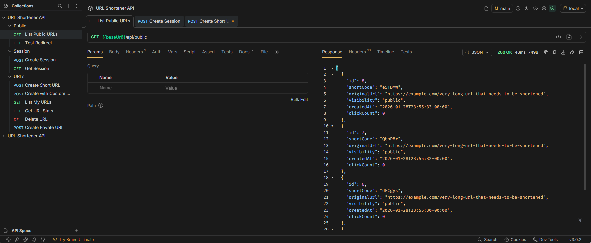
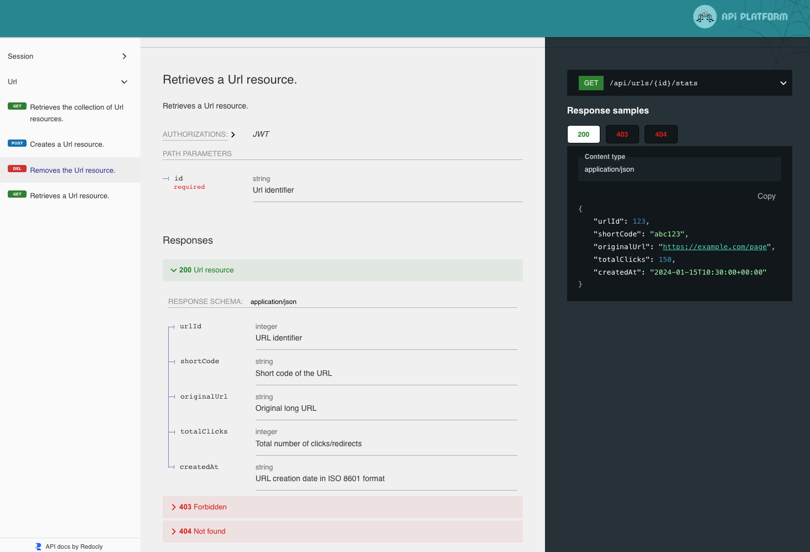

# URL Shortener

URL shortening service with click analytics.

**Stack**: Symfony 8, PHP 8.4, API Platform 4, PostgreSQL, RabbitMQ, Next.js 16, React 19, TypeScript

## URLs

- **Frontend**: http://localhost:3000
- **API**: http://localhost:8080/api
- **API Docs**: http://localhost:8080/api/docs (login: `docs` / password: `docs`)
- **RabbitMQ Management**: http://localhost:15672 (login: `shorturl` / password: `shorturl_secret`)

## Development Setup

Start all services (PHP, PostgreSQL, RabbitMQ, frontend):

```bash
docker-compose up -d
```

Initialize the backend (install dependencies, create database, run migrations, generate JWT keys):

```bash
./init-dev.sh
```

**Note**: `docker-compose up` automatically starts a Symfony Messenger worker container that processes the RabbitMQ queue for async URL click logging.

## API Testing with Bruno


Bruno is a fast, open-source API client that stores collections as plain text files in your repository (unlike Postman's database approach), making it perfect for version control and team collaboration. Install from [usebruno.com](https://www.usebruno.com/) and open the `api-requests/shorturl-api` collection for ready-to-use API requests with automatic JWT management.



## API Documentation

Interactive OpenAPI documentation available at http://localhost:8080/api/docs (login: `docs` / password: `docs`). Test endpoints directly from your browser.



## Frontend

Modern, minimalistic UI with dark theme, animated particle background, and real-time URL management.


## API Endpoints

### Session
- `POST /api/session` - Create new session and get JWT token
- `GET /api/session` - Get current session info (requires JWT)

### URLs
- `POST /api/urls` - Create short URL (requires JWT)
- `GET /api/urls` - List my URLs with pagination (requires JWT)
- `GET /api/urls/{id}/stats` - Get URL statistics (requires JWT)
- `DELETE /api/urls/{id}` - Soft delete URL (requires JWT)

### Public
- `GET /api/public` - List all public URLs with pagination
- `GET /{shortCode}` - Redirect to original URL

## Features

- Sessionless authentication (JWT)
- Custom aliases or auto-generated short codes (6-8 chars)
- Public/private visibility
- Optional expiration (1h/1d/1w)
- Click statistics (async via RabbitMQ)
- Rate limiting (10 URLs per minute per session)
- Soft delete

## Tests

Backend includes unit tests and API integration tests covering all endpoints.

```bash
cd backend
composer tests
```
